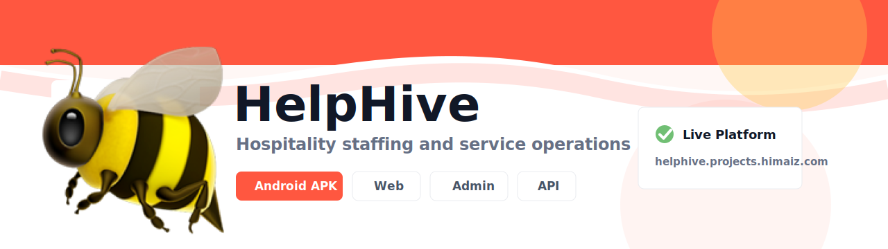

# HelpHive

HelpHive connects hospitality tea ms with trusted service providers for room at tendant, public area attendant, and linen por ter work.

  <a href="https://github.com/ Helphive/helphive-app/releases/download/produ ction-07/helphive-universal.apk"></a >
  

##  Download Android App

Download the latest And roid APK directly from GitHub:

**[Download h elphive-universal.apk](https://github.com/Hel phive/helphive-app/releases/download/producti on-07/helphive-universal.apk)**

Install step s:

1. Download `helphive-universal.apk` on y our Android device.
2. Open the downloaded fi le.
3. Allow installs from your browser or fi le manager if Android asks.
4. Tap **Install* *.

## Live Platform

  
  
  

 

## Repositories

  
  <a href= "https://github.com/Helphive/helphive-web"><i mg alt="Web App Repo" src="https://img.shield s.io/badge/Web_App-React-61DAFB?style=flat-sq uare&logo=react&logoColor=111827"></a>
  
  <a href ="https://github.com/Helphive/helphive-backen d">< /a>

- [helphive-app](https://github.com /Helphive/helphive-app) - Expo mobile app.
-  [helphive-web](https://github.com/Helphive/he lphive-web) - Customer and provider web app.
 - [helphive-admin](https://github.com/Helphiv e/helphive-admin) - Admin dashboard.
- [helph ive-backend](https://github.com/Helphive/help hive-backend) - Node.js/Express API.

For sup port, contact support@helphive.projects.himai z.com. 